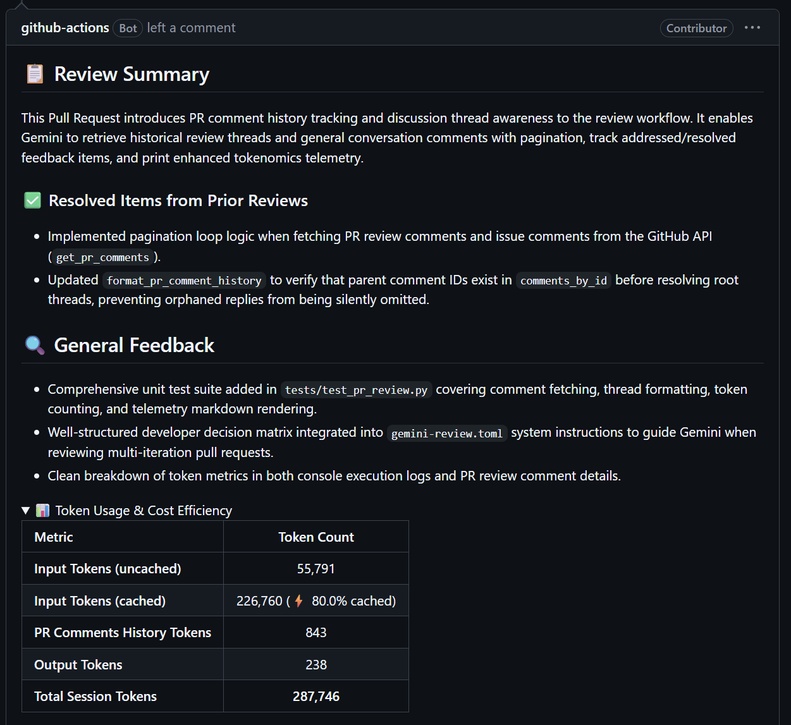
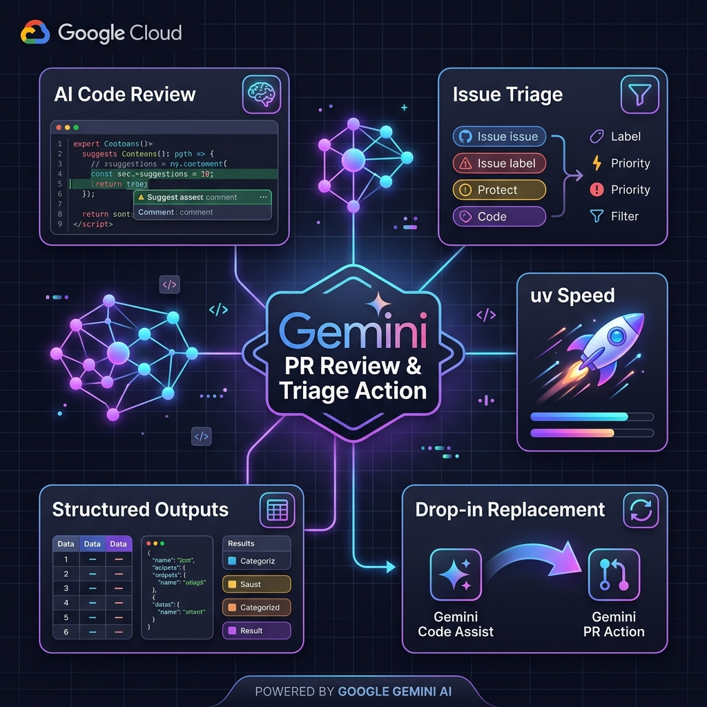
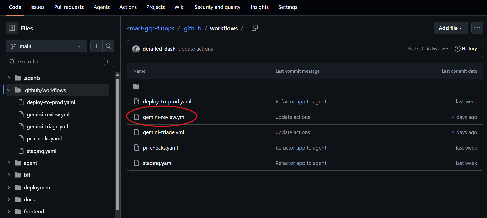
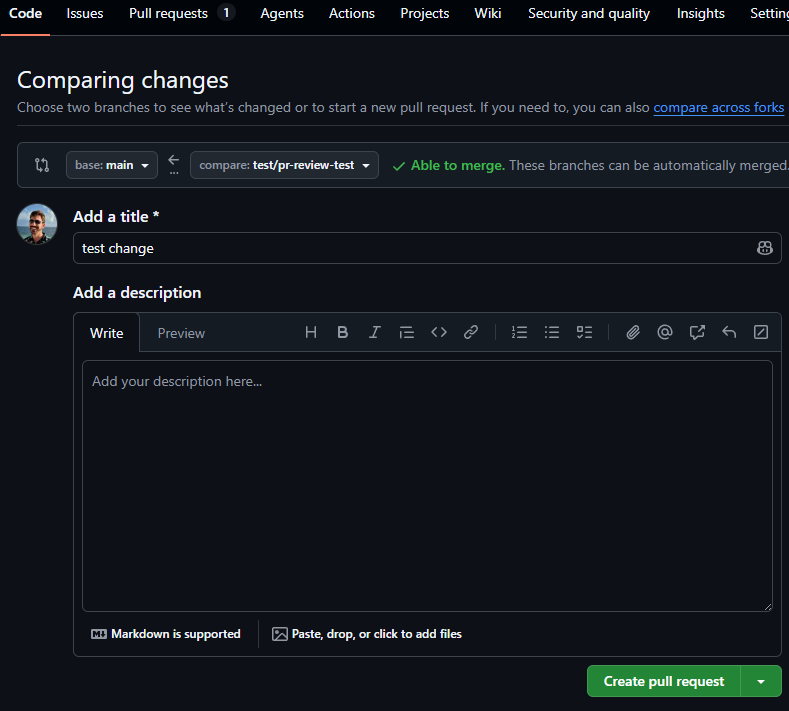
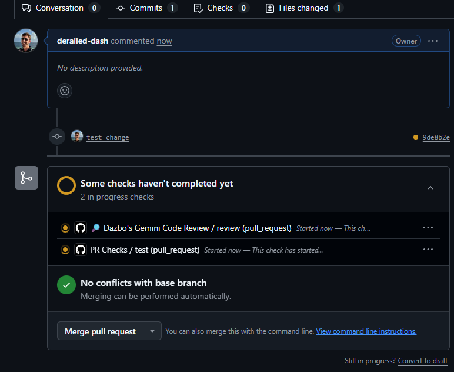
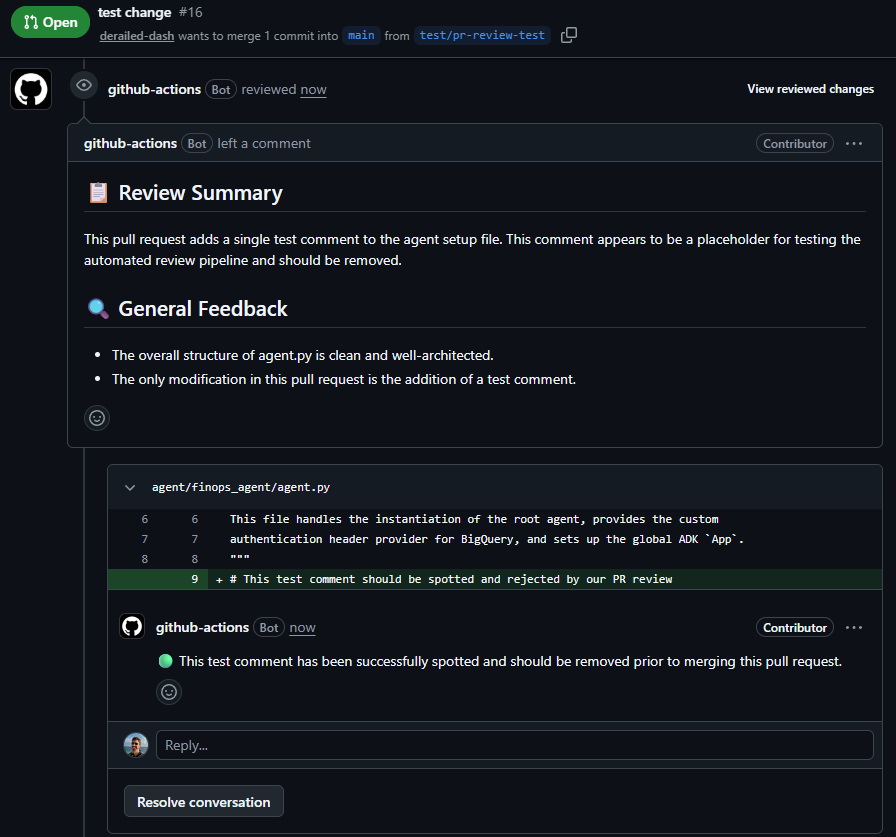
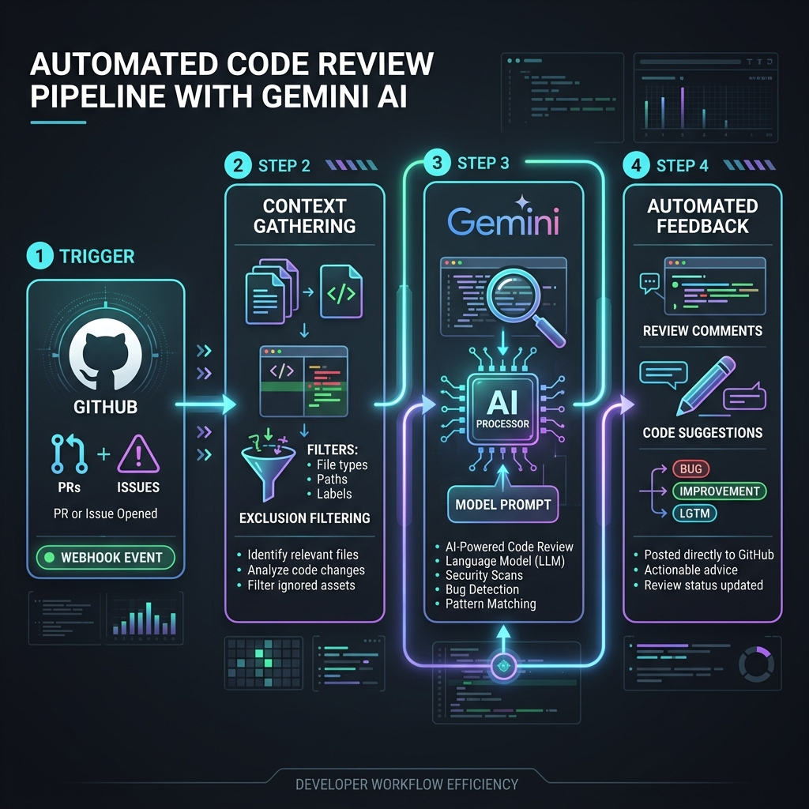

# Gemini PR Review & Triage Action


**Automated, Google Gemini-based Pull Request reviews and Issue Triaging for all your GitHub repositories and CI/CD pipelines.**



See the supporting blog post about this action [here](https://medium.com/google-cloud/automated-github-code-reviewsusing-google-gemini-7b4d027b3092).

## Table of Contents

- [Features Overview](#features-overview)
- [Author](#author)
- [License](#license)
- [How It Works](#how-it-works)
- [The "Clean Slate" Advantage](#the-clean-slate-advantage)
- [Setup & Use](#setup--use)
  - [Authentication with Gemini API Key](#authentication-with-gemini-api-key)
  - [Google Developer Knowledge MCP Integration (Optional)](#google-developer-knowledge-mcp-integration-optional)
  - [On-Demand Agent Skills (Coding Guidelines)](#on-demand-agent-skills-coding-guidelines)
  - [PR Comment History & Discussion Thread Tracking](#pr-comment-history--discussion-thread-tracking)
  - [Setup Using Install-Gemini-Code-Review-Action Skill (Recommended)](#setup-using-install-gemini-code-review-action-skill-recommended)
  - [Alternative Manual Setup: PR Review Action Definition](#alternative-manual-setup-pr-review-action-definition)
  - [Seeing It In Action](#seeing-it-in-action)
  - [Issues Triage Action Definition](#issues-triage-action-definition)
- [Configuration](#configuration)
  - [Action Inputs](#action-inputs)
  - [Codebase Context Configuration](#codebase-context-configuration)
  - [Custom Prompts / Instructions](#custom-prompts--instructions)
  - [Prompt Placeholders](#prompt-placeholders)
- [Understanding the Token Usage & Cost Efficiency Report](#understanding-the-token-usage--cost-efficiency-report)
  - [Metrics Explained](#metrics-explained)
- [Pipeline Architecture & Execution](#pipeline-architecture--execution)
- [Alternative Authentication](#alternative-authentication)
- [Development & Releases](#development--releases)
  - [Local Development & Testing](#local-development--testing)
  - [Deploying & Publishing Updates](#deploying--publishing-updates)
- [Cost Attribution & Estimation](#cost-attribution--estimation)

## Features Overview



- **AI-Powered Code Reviews**: Automated, constructive line-specific feedback on Pull Requests using Google Gemini models (Gemini 3.6 Flash by default).
- **Automated Issue Triage**: Dynamically labels, prioritises, and triages incoming issues.
- **PR Comment & Discussion Thread History**: Automatically retrieves inline review threads and general PR conversation comments with pagination, enabling Gemini to track issue resolution, respect developer justifications/disagreements, and avoid repeating resolved suggestions across commits.
- **Tokenomics & Cost Telemetry Report**: Prints a detailed cost efficiency and token usage table to the workflow execution log on every run, breaking down prompt tokens, context cache savings, comment history tokens, fresh tokens, and candidate tokens.
- **Drop-in Migration**: Fully compatible as a direct, drop-in replacement for the deprecated `run-gemini-cli` action.
- **Structured Outputs**: Error-free JSON response formatting using Pydantic schema validation.
- **Hybrid Codebase Context**: Automatically includes codebase context based on the overall size of the codebase. If the codebase isn't huge, the entire repo is loaded into context; but if it is huge, the agent reads the overall directory tree and judiciously includes a subset of the repo. (Note that it always reads markdown files, dependency files, packaging files, etc.)
- **Interactive Suggestions**: Formats code recommendations inside native GitHub ` ```suggestion ` blocks for one-click merge applications.
- **Triggers**: The action triggers automatically in response to PR events. It can also be triggered by posting a comment in the PR starting with `/gemini-review`.
- **Fast-Execution Composite Action**: Avoids containerisation build/pull latency (no slow `docker build` on every execution) by running as a native composite action.
- **Cross-Platform Support**: Runs natively on Linux, macOS, and Windows runners (both GitHub-hosted and self-hosted).
- **Modern SDK Execution**: Leverages the modern Google GenAI SDK (`google-genai`).
- **Enterprise-Grade Security**: Authentication via either Google Gemini API Keys or Google Cloud Workload Identity Federation (WIF).
- **Customisable Prompts**: Supports repository-specific overrides for both reviews and triaging via simple TOML config files.
- **Google Developer Knowledge Integration**: Automatically queries official Google developer documentation (Google Cloud, Firebase, Android, etc.) via MCP to cross-reference your changes against up-to-date best practices.
- **On-Demand Agent Skills**: Dynamically discovers and loads project-specific formatting guidelines and coding standards from `.agents/skills` on-demand, keeping prompt contexts lightweight and relevant (bundled with defaults for Google Cloud, Gemini APIs and agentic development).
- **Gemini Context Caching**: Native, automatic integration with Gemini Context Caching, delivering up to **90% cost reduction** on input tokens for repositories over 32k tokens.
- **Multi-Turn & Cross-PR Cache Reuse**: Reuses active server-side context cache handles across multi-turn tool/skill calls and successive PR pushes within the TTL window (1h default), eliminating prompt re-tokenisation and server overhead. This is a huge efficiency and cost saving between successive reviews.


## Author

Developed and maintained by **Darren 'Dazbo' Lester** (GitHub: [@derailed-dash](https://github.com/derailed-dash)).

## License

This project is licensed under the MIT License - see the [LICENSE](LICENSE) file for details.

## How It Works

1. **Change Discovery**: The action scans the Pull Request diff. It uses a robust extension and path exclusion list to automatically filter out binary, encrypted, or locked files (like `.png`, `.enc`, `uv.lock`, `.env`, etc.).
2. **Hybrid Context Enrichment**: In addition to surrounding modified file content, the action gathers context from the rest of the repository. It measures the total size of all other tracked text files:
   - **Full Context Mode**: If the codebase is under the configured size threshold (default: 1.5 MB), the full contents of all other text files are included.
   - **Sparse Context Mode**: If the codebase exceeds the threshold, it includes a structured text-based file tree of the entire project, plus the full contents of key configuration and documentation files (like `*.md`, `pyproject.toml`, `package.json`, `go.mod`, etc.).
3. **Gemini Context Caching & Multi-Turn Reuse**: For repository contexts exceeding ~32,768 tokens (100,000+ characters), the action automatically checks for an active server-side cache (`repo-cache-{repo}`) via `client.caches.list()`. If found, it reuses the active cache handle; otherwise, it provisions a fresh context cache. Billed input tokens receive a **90% discount**, and subsequent multi-turn tool/skill calls reference the cached context handle without re-billing the codebase context.
4. **Structured Review Generation**: The action sends the diff and file contexts to Gemini. It uses Gemini's native **Structured Outputs** (`response_schema`) to force the model to respond in a strict JSON format.
5. **Interactive suggestions**: Change recommendations are wrapped in native GitHub ` ```suggestion ` blocks, allowing reviewers to apply the changes directly on the PR with one click.
6. **Resilient Comment Posting**: The review is posted atomically via the GitHub Pull Request Review API. If the API call fails (e.g. if the model hallucinates an invalid line number in the diff), the script catches the error and falls back to posting comments individually, ensuring your CI status check stays green while still delivering all valid feedback.

## The "Clean Slate" Advantage

One key benefit of running code reviews via this CI/CD-based GitHub Action is the complete absence of **session bias**.

When interacting with a local AI assistant during development, the model is inevitably influenced by your ongoing conversation, intermediate code drafts, and the developmental history of your changes. While this conversational context is incredibly helpful for writing code, it can also bias the local assistant, causing it to accept compromises or overlook subtle regressions because it understands your *intent* so well.

This action acts as a stateless, independent reviewer with a clean slate. It has no knowledge of how you arrived at the solution or what you discussed locally. By reviewing the raw pull request diff against the repository context, it is far more likely to identify gaps, edge cases, and safety issues that your local assistant might have missed or forgiven.

## Setup & Use

### Authentication with Gemini API Key

This one-time setup (per repo) is required to allow the action to authenticate to Google Gemini.

By default, this action uses a repository secret called `gemini_api_key`. You can create this key, for example, in [Google AI Studio](https://aistudio.google.com/). 

Add this variable to your repo:

1. Navigate to **Settings** > **Secrets and variables** > **Actions**.
2. Click **New repository secret**.
3. Name the secret `GEMINI_API_KEY` and paste your API key as the value.
4. Reference it in your workflow file as `${{ secrets.GEMINI_API_KEY }}`.

> [!NOTE]
> The `secrets.GITHUB_TOKEN` is automatically created and populated by GitHub for every workflow run. You do not need to add it to your repository secrets manually. You only need to ensure the correct `permissions` are defined in the workflow file, as shown in the examples.

If you prefer to authenticate using a combination of **Google Cloud Workload Identity Federation (WIF)** and **Application Default Credentials (ADC)** with Gemini Enterprise Agent Platform (formerly known as Vertex AI), you can omit `gemini_api_key`. This allows the action to authenticate securely with Google Cloud without storing a long-lived service account key JSON file in your repository.

Alternatively, we can use WIF and ADC to authenticate. In this approach, we do not use persistent Gemini API key. This will be shown later.

### Google Developer Knowledge MCP Integration (Optional)

This action natively supports the **Google Developer Knowledge MCP API**. If available under your `GEMINI_API_KEY` (or Google Cloud Application Default Credentials), the PR reviewer agent can dynamically query official, up-to-date documentation for services like Google Cloud, Firebase, and Android to ensure your code follows best practices.

To enable this capability, see [Google Developer Knowledge Setup Guide](docs/developer_knowledge.md).

### On-Demand Agent Skills (Coding Guidelines)

This action supports **On-Demand Skills Discovery**. Instead of cramming all your repository's formatting rules, coding guidelines, and API specs directly into the prompt context (which wastes tokens and confuses the model), the reviewer agent queries a list of available guidelines and loads the relevant instructions dynamically as needed.

#### 1. Default (Built-in) Skills Included
The action comes pre-packaged with a comprehensive set of default skills that are automatically available for every run. These cover:
*   **Google Enterprise & Agent Development**: Best practices for Google ADK (Agent Development Kit), Gemini Agents API, serving endpoint management, prompt orchestration, and model tuning.
*   **Google Cloud Best Practices**: Official architecture patterns, operational excellence, reliability, performance, security, and GCS/Cloud Run/GKE setup.
*   **Data Analytics**: BigQuery query optimization, BigFrames, property graphs, and time-series forecasting.

#### 2. Adding Custom Skills to Your Repository
To add project-specific coding standards or team rules that your PR reviewer should check against:
1.  Create a folder named `.agents/skills/` at the root of your repository.
2.  Add a subdirectory for your skill, and create a `SKILL.md` file inside it (e.g. `.agents/skills/my-react-rules/SKILL.md`).
3.  Format the file with a YAML frontmatter header containing its name and description:
    ```markdown
    ---
    name: "My Project Style Guide"
    description: "Rules for component structure, CSS modules, and custom hooks"
    ---
    # Instructions
    Write your detailed rules here...
    ```
4.  Commit and push these files. The PR review agent will automatically detect your project's custom guidelines and invoke them when reviewing relevant code changes.

### PR Comment History & Discussion Thread Tracking

When reviewing pull requests that have undergone multiple iterations or team discussions, Gemini automatically retrieves prior inline review threads (`pulls/{pr_number}/comments`) and general PR conversation comments (`issues/{pr_number}/comments`) using automatic pagination loops.

#### How Discussion Tracking Works:
1. **Thread Grouping:** Root review comments and developer replies are structured into conversational threads mapped to specific files and line numbers.
2. **Developer Workflow Rules for Follow-Up Reviews:**
   Gemini evaluates prior comment history against the incoming diff patch and enforces an opinionated developer workflow matrix:
   - **a) Addressed / Resolved:** The developer applies the requested code fix. Gemini detects that the diff patch addresses the suggestion, omits the duplicate inline comment, and lists it under `### ✅ Resolved Items from Prior Reviews`.
   - **b) Deferred:** The developer defers the work (e.g. by linking a follow-up issue or noting it in comments). Gemini respects the deferral and refrains from repeating the suggestion.
   - **c) Disagreed / Ignored with Explanation:** The developer responds explaining why the suggested change was not made (e.g. architectural design choice or performance trade-off). Gemini respects the explanation and refrains from repeating the critique.
   
   > [!IMPORTANT]
   > **No Silent Drops:** A PR suggestion is **never ignored without justification**. If the code remains unchanged AND the developer has provided **no explanation or reply**, or if the developer **agreed** in comment threads but has **not yet pushed the code fix**, Gemini will default to **re-flagging and restating** the unresolved suggestion in the follow-up review.

3. **Resolved Items Reporting:** When Gemini identifies that previously raised feedback has been fixed in the latest push, it includes a dedicated section in the PR review summary:
   ```markdown
   ### ✅ Resolved Items from Prior Reviews
   - Added exception handling in `src/main.py` (Line 45)
   - Standardised type annotations in `utils.py` (Line 12)
   ```

### Setup Using Install-Gemini-Code-Review-Action Skill (Recommended)

If you are using an agentic coding environment like Google Antigravity, you can install and configure this action and its triage workflow automatically using Dazbo's skill from [derailed-dash/dazbo-agent-skills](https://github.com/derailed-dash/dazbo-agent-skills).

> [!IMPORTANT]
> **Prerequisite:** Regardless of whether you use the automatic skill setup or the manual setup, you must configure authentication (either a Gemini API Key or Workload Identity Federation) as described in the **Authentication** section above.

The `install-gemini-code-review-action` skill automatically handles:
- Detecting and removing conflicting legacy workflows (e.g., `run-gemini-cli` or `gemini-code-assist`).
- Asking for your preferences (e.g., installing PR Review, Issue Triage, or both, plus your preferred language and model).
- Writing the workflow YAML files and default TOML prompt configurations.
- Commit and push of the new workflow files.

To install the skill locally, run:
```bash
npx skills add https://github.com/derailed-dash/dazbo-agent-skills -y -g --skill install-gemini-code-review-action
```

Once installed, simply ask your agent:
> "Install the Gemini code review action"

---

### Alternative Manual Setup: PR Review Action Definition

One-time step: add this GitHub Action to your repository, by copying the starter example workflow [gemini-review.yml](starter-examples/gemini-review.yml) to `.github/workflows/gemini-review.yml` in your repo (or use the inline template below):

```yaml
name: "🔎 Dazbo's Gemini Code Review"

on:
  pull_request:
    branches:
      - main
    # Optional: restrict trigger paths (supports inclusions & exclusions)
    # paths:
    #   - 'src/**'
    #   - '!src/generated/**'  # Exclude generated files
    #   - 'pyproject.toml'
  issue_comment:
    types: [created]

jobs:
  review:
    # Run on PR updates, OR on issue comment starting with /gemini-review by repo owners/members
    if: |
      github.event_name == 'pull_request' ||
      (
        github.event_name == 'issue_comment' &&
        github.event.issue.pull_request &&
        startsWith(github.event.comment.body, '/gemini-review') &&
        contains(fromJSON('["OWNER", "MEMBER", "COLLABORATOR"]'), github.event.comment.author_association)
      )
    runs-on: ubuntu-latest
    permissions:
      contents: read
      pull-requests: write
      issues: write

    steps:
      - name: Checkout repository
        uses: actions/checkout@v6
        with:
          # Automatically checks out the head ref for PR events,
          # and pulls the PR head branch for comment-based triggers
          ref: ${{ github.event.pull_request.head.sha || format('refs/pull/{0}/head', github.event.issue.number) }}

      - name: Run Gemini Review Action
        uses: derailed-dash/gemini-review-action@v1
        with:
          gemini_api_key: ${{ secrets.GEMINI_API_KEY }}
          github_token: ${{ secrets.GITHUB_TOKEN }}
          gemini_model: 'gemini-3.6-flash'
          language: 'English (UK)'           # Optional (e.g. English (UK), French, Spanish)
```

After adding the workflow to your repository, it should look something like this:



### Seeing It In Action

1. Create a PR in the repository:

    

2. Watch the workflow run. The action will automatically start a review process:

    

3. Once complete, you will see a review comment with recommendations:

    


#### Filtering Trigger Paths (Inclusions & Exclusions)

By default, GitHub Actions will trigger the code review workflow on a `pull_request` event for changes to *any* files in the repository. You can restrict which files trigger the workflow by configuring `paths` or `paths-ignore` under the trigger configuration.

To only review files under certain directories or with specific file extensions, use the `paths` key:

```yaml
on:
  pull_request:
    paths:
      - 'src/**'
      - 'tests/**'
      - 'pyproject.toml'
```

You can define exclusions in two ways:

1.  **Exclusions within inclusions (`!` prefix):**
    If you want to review a directory but exclude specific subdirectories or file types, prefix the pattern with `!`. Note that negative patterns must follow at least one positive pattern.
    ```yaml
    on:
      pull_request:
        paths:
          - 'src/**'
          - '!src/generated/**'  # Exclude generated files
    ```

2.  **Excluding paths globally (`paths-ignore`):**
    If you want to run the review for all files except for certain folders (like documentation or configurations), use `paths-ignore`:
    ```yaml
    on:
      pull_request:
        paths-ignore:
          - 'docs/**'
          - '**.md'
    ```

> [!NOTE]
> Regardless of your workflow's `paths` trigger, the underlying Python script automatically filters out binary, locked, and encrypted files (such as `.png`, `.enc`, `package-lock.json`, and `uv.lock`) before sending the code context to Google Gemini.

#### Triggering Reviews via Comments

If the workflow is configured to allow triggering via comments (e.g. with the `issue_comment` trigger as shown in the example above), you can trigger a code review manually at any time by posting a comment on the Pull Request:

* Simply comment `/gemini-review` on the PR.
* **Security & Access Control:** To prevent unauthorised runs and control costs, the action will only trigger if the commenter is an `OWNER`, `MEMBER`, or `COLLABORATOR` of the repository.

### Issues Triage Action Definition

Add this GitHub Action to your repository, by copying the starter example workflow [gemini-triage.yml](starter-examples/gemini-triage.yml) to `.github/workflows/gemini-triage.yml` in your repo (or use the inline template below):

```yaml
name: "🏷️ Dazbo's Gemini Issue Triage"

on:
  issues:
    types: [opened, reopened]

jobs:
  triage:
    runs-on: ubuntu-latest
    permissions:
      contents: read
      issues: write

    steps:
      - name: Checkout repository
        uses: actions/checkout@v6

      - name: Run Gemini Triage Action
        uses: derailed-dash/gemini-review-action@v1
        with:
          command: 'triage'        
          gemini_api_key: ${{ secrets.GEMINI_API_KEY }}
          github_token: ${{ secrets.GITHUB_TOKEN }}
          gemini_model: 'gemini-3.6-flash'
          language: 'English (UK)'           # Optional
```

## Configuration

### Action Inputs

| Input | Description | Required | Default |
| :--- | :--- | :--- | :--- |
| `gemini_api_key` | Your Gemini Developer API Key (from Google AI Studio). | **Yes** (unless using WIF) | N/A |
| `github_token` | Repository `GITHUB_TOKEN` (automatically provided by GitHub; no manual secret creation required). | **Yes** | N/A |
| `gemini_model` | The Gemini model version to target. | No | `gemini-3.6-flash` |
| `command` | The mode/command to run: `review` (for PR reviews) or `triage` (for issue triaging). | No | `review` |
| `include_comment_history` | Whether to fetch prior inline review threads and conversation comments from GitHub. | No | `'true'` |
| `language` | The language to use for the review comments (e.g. `English (UK)`, `English (US)`, `French`, `Spanish`). | No | `English (UK)` |
| `timeout` | Timeout for API requests in seconds. | No | `60` |

### Codebase Context Configuration

By default, the action uses a hybrid context engine to feed codebase context to the model during review:
*   **max_context_bytes** (Default: `1500000` / 1.5 MB): The total size of all other text files in the repository. At ~375,000 tokens, 1.5 MB safely fits within Gemini's 1M+ token window while leaving plenty of headroom for the PR diff/patch and structured reviews. If the repository is smaller than this limit, the action runs in *Full Context Mode* and includes all files. If the repository exceeds this limit, it switches to *Sparse Context Mode*.
*   **core_file_patterns**: A list of glob patterns matching project manifest, build, or documentation files that should always be read and passed along as context in *Sparse Context Mode*.

You can configure these settings by adding the following keys to your custom `.github/commands/gemini-review.toml` configuration:

```toml
# Codebase Context Configuration (Optional)
max_context_bytes = 1500000  # Threshold in bytes
core_file_patterns = ["*.md", "pyproject.toml", "package.json", "go.mod", "Cargo.toml"]  # File patterns to always include
```

### Custom Prompts / Instructions

This action bundles high-quality default prompt configurations for both review and triage:
* **Default Review Prompt:** [starter-examples/gemini-review.toml](starter-examples/gemini-review.toml)
* **Default Triage Prompt:** [starter-examples/gemini-triage.toml](starter-examples/gemini-triage.toml)

You can customize or completely override the prompt instructions given to the review or triage reviewers on a repository-by-repository basis:

* **To override the Code Review prompt:** Create a file at `.github/commands/gemini-review.toml` in your calling repository.
* **To override the Issue Triage prompt:** Create a file at `.github/commands/gemini-triage.toml` in your calling repository.

Your custom TOML file must contain a `prompt` key enclosing your system instructions in markdown format:

```toml
description = "Reviews a pull request with Gemini"
prompt = """
## Role
You are a world-class code review assistant.

## Primary Directive
Review the diff and full file contents to identify performance, security, and logic bugs.

## Rules
- Focus comments strictly on lines added or modified (lines starting with `+` or `-`).
- Use English (UK) spelling for all review feedback text.
- Do not make comments on formatting unless it is an egregious style guide violation.

- **GitHub Repository**: !{echo $REPOSITORY}
- **Pull Request Number**: !{echo $PULL_REQUEST_NUMBER}
"""
```

### Prompt Placeholders

The action parses the TOML files and dynamically substitutes the following expressions:

* **Code Review placeholders:**
  * `!{echo $REPOSITORY}`: Replaced with the current repository name (e.g. `derailed-dash/my-repo`).
  * `!{echo $PULL_REQUEST_NUMBER}`: Replaced with the number of the Pull Request being triaged.
  * `!{echo $ADDITIONAL_CONTEXT}`: Replaced with empty space or triggering comment arguments.

* **Issue Triage placeholders:**
  * `!{echo $AVAILABLE_LABELS}`: Replaced with a comma-separated list of available labels.
  * `!{echo $ISSUE_TITLE}`: Replaced with the title of the issue.
  * `!{echo $ISSUE_BODY}`: Replaced with the body text of the issue.
  * `!{echo $GITHUB_ENV}`: Replaced with the file path to append output environment variables.

## Understanding the Token Usage & Cost Efficiency Report

Whenever a review run finishes, the action provides token telemetry in two places:

1. **Pull Request Review Output**: A collapsible `<details>` section appended directly to the bottom of the posted PR review comment on GitHub:

   <details>
   <summary>📊 Token Usage & Cost Efficiency</summary>

   | Metric | Token Count |
   | :--- | :---: |
   | **Input Tokens (uncached)** | 14,414 |
   | **Input Tokens (cached)** | 250,985 (⚡ 94.4% cached) |
   | **PR Comments History Tokens** | 450 |
   | **Output Tokens** | 210 |
   | **Total Session Tokens** | **267,701** |

   </details>

2. **Workflow Execution Logs**: A detailed ASCII telemetry table printed to the runner logs:

```text
📊 Gemini Token Usage & Cost Efficiency Report
┌──────────────────────────────────┬──────────────┬───────────────────────────────┐
│ Metric                           │ Token Count  │ Benefit / Efficiency          │
├──────────────────────────────────┼──────────────┼───────────────────────────────┤
│ Total Input (Prompt) Tokens      │      265,849 │ Base input context            │
│ ├── Cached Context Tokens        │      250,985 │ ⚡ 94.4% (90% Rate Discount)  │
│ ├── PR Comments History Tokens   │          450 │ Prior review threads context  │
│ └── Un-cached Fresh Tokens       │       14,414 │ Diff & instructions only      │
│ Output (Candidates) Tokens       │          210 │ Generated review content      │
├──────────────────────────────────┼──────────────┼───────────────────────────────┤
│ Total Session Tokens             │      267,701 │ Total processed by Gemini     │
└──────────────────────────────────┴──────────────┴───────────────────────────────┘
```

### Metrics Explained

* **Total Input (Prompt) Tokens**: The total size (in LLM tokens) of the context sent to Gemini (full repository codebase files, system instructions, PR comment history, and PR diff patch).
* **Cached Context Tokens (`├── Cached Context Tokens`)**: The portion of input tokens stored in Gemini's server-side context cache. Context caching applies **exclusively to input tokens**, providing an **automatic 90% rate discount** on cached input tokens.
* **PR Comments History Tokens (`├── PR Comments History Tokens`)**: The exact token count consumed by historical inline review threads and conversation comments fetched via the GitHub API and included in the dynamic review context.
* **Un-cached Fresh Tokens (`└── Un-cached Fresh Tokens`)**: The newly introduced PR diff lines and dynamic skill instructions, billed at standard input rates.
* **Output (Candidates) Tokens**: The number of tokens generated by Gemini in its structured review response JSON. Context caching does not apply to output tokens, which are billed at standard model output rates.
* **Total Session Tokens**: The combined total of prompt and output tokens processed during the review.

## How It Works



### Step-by-Step

1. **Trigger**: A developer opens or pushes an update to a Pull Request, or opens/reopens an Issue. GitHub Actions detects this webhook event and starts a runner to execute the review or triage action.
2. **Context Gathering**:
   - The action retrieves the Pull Request diff from the GitHub API.
   - It performs exclusion filtering to automatically ignore non-text files and configured paths (like lock files or binaries).
   - For all remaining modified files, it reads the full text from the local workspace filesystem to provide surrounding file context.
3. **Gemini AI Analysis**: The action packs the diff, the full-file surrounding context, and the system prompt instructions (loaded from [gemini-review.toml](starter-examples/gemini-review.toml) or [gemini-triage.toml](starter-examples/gemini-triage.toml)) into a payload and sends it to the Google Gemini API. The model performs in-depth analysis (assessing code quality, identifying bugs or improvements, and scanning for security concerns).
4. **Automated Feedback**:
   - The model generates a structured assessment guaranteed to follow the Pydantic schema constraints (such as [ReviewResult](gemini_pr_review.py#L35-L39)).
   - The action parses this structured response and automatically posts comments (including severity markers and interactive suggestions) or labels back to the GitHub PR or Issue.
   - **Resilience:** If a PR comment contains a line range mismatch, the resilient handler falls back to publishing comments individually so that valid reviews are not lost and the workflow status stays green.

### Review Response Format

Gemini uses a strict Pydantic schema to generate reviews. Every submitted review contains:

1. **📋 Review Summary**: A 2-3 sentence assessment of the pull request's overall objective and quality.
2. **🔍 General Feedback**: A bulleted list of high-level observations and positive highlights.
3. **💬 Inline Comments**: Line-specific comments containing:
   - Severity icons: `🔴` (Critical), `🟠` (High), `🟡` (Medium), `🟢` (Low).
   - Constructive explanation written in English (UK) spelling.
   - Interactive code replacement suggestion blocks (optional).

### Logging & Troubleshooting

All standard output (`stdout`) and error logs (`stderr`) produced by the action's execution (such as API call progress, validation warnings, or error details) are printed directly to the console. 

You can view these logs by opening the specific workflow run in the **Actions** tab of your GitHub repository, selecting the active job (e.g. `review` or `triage`), and expanding the **Run Script** step.

## Alternative Authentication

**Using Google Workload Identity Federation (WIF) and Application Default Credentials (ADC)**

For this authentication approach, you must configure the following in your calling workflow:

1. **OIDC Permissions:** Grant the workflow job `id-token: write` permission so GitHub can request OIDC credentials.
2. **Authenticate Step:** Run the `google-github-actions/auth` step prior to running this action to exchange GitHub's OIDC token for Google Cloud credentials.
3. **Environment Variables:** Pass the required Google Cloud environment variables (`GOOGLE_GENAI_USE_VERTEXAI`, `GOOGLE_CLOUD_PROJECT`, and `GOOGLE_CLOUD_LOCATION`) to the review action.

To keep your infrastructure details private, you should save the following as GitHub repository secrets:
* `GCP_SERVICE_ACCOUNT`: The email address of your Google Cloud service account.
* `WIF_POOL_ID`: The ID of your Workload Identity Pool (e.g. `my-pool`).
* `WIF_PROVIDER_ID`: The ID of your Workload Identity Provider (e.g. `my-provider`).

Example workflow job configured to run the review action with WIF authentication:

```yaml
jobs:
  review:
    runs-on: ubuntu-latest
    permissions:
      contents: read
      pull-requests: write
      id-token: write # Required for WIF OIDC token exchange

    steps:
      - name: Checkout repository
        uses: actions/checkout@v6
        with:
          ref: ${{ github.event.pull_request.head.sha || format('refs/pull/{0}/head', github.event.issue.number) }}

      - name: Authenticate to Google Cloud via WIF
        uses: google-github-actions/auth@v2
        with:
          workload_identity_provider: 'projects/123456789012/locations/global/workloadIdentityPools/${{ secrets.WIF_POOL_ID }}/providers/${{ secrets.WIF_PROVIDER_ID }}'
          service_account: '${{ secrets.GCP_SERVICE_ACCOUNT }}'

      - name: Run Gemini Review Action
        uses: derailed-dash/gemini-review-action@v1
        env:
          GOOGLE_GENAI_USE_VERTEXAI: "True"
          GOOGLE_CLOUD_PROJECT: "my-project-id"
          GOOGLE_CLOUD_LOCATION: "global" # Or your preferred model endpoint region
        with:
          github_token: ${{ secrets.GITHUB_TOKEN }}
          gemini_model: 'gemini-3.6-flash'
```

> [!NOTE]
> When `GOOGLE_GENAI_USE_VERTEXAI` is set to `"True"`, the underlying `google-genai` SDK uses Application Default Credentials (ADC) to automatically locate and use the short-lived credentials configured on the runner by the `google-github-actions/auth` step.

## Development & Releases

### Local Development & Testing

#### Repository Structure

Here is an overview of the directory tree and the purpose of each file:

```text
.                                   
├── .github/                 # GitHub workflows (used for dogfooding our own action)
├── assets/                  # Documentation assets (banners, images)
├── docs/                    # Technical documentation and architecture guides
├── starter-examples/        # Starter workflow files and default prompt templates
├── tests/                   # Unit tests
├── action.yml               # GitHub Action definition (inputs, environment, and steps)
├── CONTRIBUTING.md          # Collaboration guidelines for developers
├── gemini_issue_triage.py   # Python script to triage and label incoming issues
├── gemini_pr_review.py      # Python script to review PRs
├── pyproject.toml           # Python project config, dependencies
└── README.md                # Project documentation, setup guide, and usage examples
```

> [!NOTE]
> The `.github/` folder in this repository contains the workflows we use to dogfood our own action on this project. If you are installing this action in your own repository, you do not need to care about or copy this folder; you only need to reference `uses: derailed-dash/gemini-review-action` in your own workflow files.


For a detailed guide on how the inner workings, prompt generations, and codebase parsing logic are implemented, see our [Architecture & Code Walkthrough](docs/architecture.md).

This project uses `uv` for python environment and dependency management. To configure your local environment and run the test suite:

1. **Install Dependencies:**
   Run `uv sync` to create a virtual environment (`.venv`) and install all runtime and development packages.
   ```bash
   uv sync
   ```

2. **Linting & Code Formatting:**
   We enforce strict syntax, formatting, and spelling checks using `ruff` and `codespell`. Run these from the project root:
   ```bash
   uvx codespell@latest -s
   uvx ruff@latest check --fix .
   ```

3. **Running the Unit Tests:**
   Run the unit test suite with `pytest`:
   ```bash
   uv run pytest
   ```

### Deploying & Publishing Updates

GitHub Actions are versioned by Git tags. When other repositories consume this action, they reference a specific tag (e.g. `uses: derailed-dash/gemini-review-action@v1`). To release new changes so that they are picked up by consuming repositories, you need to publish a release and update the major version tag.

Follow this step-by-step workflow:

#### Step 1. Bump the Version and Synchronise the Lockfile

Update the version number in [pyproject.toml](file:///home/dazbo/localdev/gemini-review-action/pyproject.toml) to reflect the new release (e.g. `1.3.1`). Then, synchronise your lockfile to match the updated version:

```bash
# After modifying pyproject.toml
uv sync
```

#### Step 2. Commit and Push Your Changes

Ensure all your local tests pass successfully, then commit and push your changes to the main branch:

```bash
git add pyproject.toml uv.lock
git commit -m "chore(release): bump version to v1.3.1"
git push origin main
```

#### Step 3. Update the Git Tags Locally & Push to Origin

To let users lock to specific versions (like `v1.3.1`) while still allowing others to automatically receive updates via the major version tag (`v1`), create or move these tags on your local machine and push them:

1. **Create the minor/patch tag** (e.g. `v1.3.1`):
   ```bash
   git tag -fa v1.3.1 -m "Release version v1.3.1"
   ```
2. **Move the major version tag** (`v1`) to point to this new release:
   ```bash
   git tag -fa v1 -m "Update v1 tag to point to v1.3.1"
   ```
3. **Push the tags to GitHub** (you must use the `--force` flag to update the existing `v1` tag on the remote server):
   ```bash
   git push origin v1.3.1
   git push origin v1 --force
   ```

#### Step 4. Draft and Publish the Release on GitHub

To make the new version officially available, update the changelog, and ensure it is visible on the GitHub Marketplace:

1. Open the repository on GitHub.
2. In the right-hand sidebar, locate the **Releases** section and click **Draft a new release** (or click the gear icon and select *Create a release*).
3. Click the **Choose a tag** dropdown:
   * Type in the version you just pushed (e.g. `v1.3.1`).
   * Select it from the dropdown.
4. Under **Release title**, enter a title for the version (e.g. `v1.3.1 - MCP and Workspace Skills Integration`).
5. **Publish to the Marketplace:**
   * Tick the checkbox next to **Publish this Action to the GitHub Marketplace**.
   * *If this is your first time publishing this action:* Accept the GitHub Developer Agreement, select a primary category (e.g. `Code quality` or `Utilities`), and customise the colour and icon for the marketplace listing card.
6. Write a summary of changes in the description box, or click **Generate release notes** to automatically construct them from your commit logs.
7. Click **Publish release**.

#### Example: Releasing Version `v1.3.1`

Here is a full example of checking tag status, bumping the version, and releasing version `v1.3.1`:

1. **Check current tag status:**
   Find the closest tag and see how many commits the branch is ahead by:
   ```bash
   git describe --tags
   # Example output: v1.3.0-4-gb824f0f (4 commits ahead of v1.3.0)
   ```

2. **Bump the version in pyproject.toml and synchronise the lockfile:**
   Ensure the version is set to `1.3.1` in `pyproject.toml`, then run:
   ```bash
   uv sync
   git commit -am "chore(release): bump version to v1.3.1"
   git push origin main
   ```

3. **Create the minor/patch tag and move the major version tag locally:**
   ```bash
   git tag -fa v1.3.1 -m "Release version v1.3.1"
   git tag -fa v1 -m "Update v1 tag to point to v1.3.1"
   ```

4. **Push tags to remote (using `--force` to update the existing `v1` tag on GitHub):**
   ```bash
   git push origin v1.3.1
   git push origin v1 --force
   ```

5. **Publish the Release:**
   Follow Step 4 to publish the release on GitHub.

## Cost Attribution & Estimation

This action is free and open-source. Although there is no license cost for using this mechanism in your repo, making use of Google Gemini models (like any AI models) is not necessarily zero cost. But it is indeed very cheap! See worked examples below.

### How Costs Are Incurred

* **Billing Attribution**: All API calls generated by this action are billed directly to the Google Cloud Project (or Google AI Studio account) associated with the `GEMINI_API_KEY` (or the Google Cloud project specified when using Workload Identity Federation / ADC). No costs are billed through GitHub.
* **Token Breakdown**: Costs are calculated strictly based on token consumption reported in the execution logs (`Gemini Token Usage`):
  * **Input Tokens (Prompt)**: Combines the system prompt instructions, PR diff/patch, and the repository file context (up to `max_context_bytes`).
  * **Output Tokens (Candidates)**: The structured JSON response containing the review summary, feedback, and line-specific suggestions.

### Estimated Cost Example (0.5 MB Codebase)

For a typical repository with **0.5 MB (~500 KB)** of tracked text files running under **Full Context Mode**:

| Metric | Estimated Volume | Description |
| :--- | :--- | :--- |
| **Input Tokens** | ~130,000 – 140,000 tokens | ~125,000 tokens for 0.5 MB repo context + ~10,000 tokens for PR diff & system prompt. |
| **Output Tokens** | ~500 – 1,500 tokens | Structured JSON review summary & line recommendations. |

Using standard model rates for **`gemini-3.6-flash`**:
* **Input Rate**: $1.50 per 1,000,000 tokens (uncached)
* **Output Rate**: $7.50 per 1,000,000 tokens

**Calculated Cost Per PR Review**:
* **Input Cost**: $140,000 \times (\$1.5 / 1,000,000) = \$0.21$
* **Output Cost**: $1,500 \times (\$7.50 / 1,000,000) = \$0.011$
* **Total Estimated Cost**: **~$0.22 per PR review**

Since most input tokens will be cached, the actual costs will typically be far lower.

### Pricing Resources

For official, up-to-date pricing details across all Gemini model tiers and regions:
* [Google AI Studio Pricing Guide](https://ai.google.dev/pricing)
* [Google Cloud Vertex AI Pricing Guide](https://cloud.google.com/vertex-ai/generative-ai/pricing)
