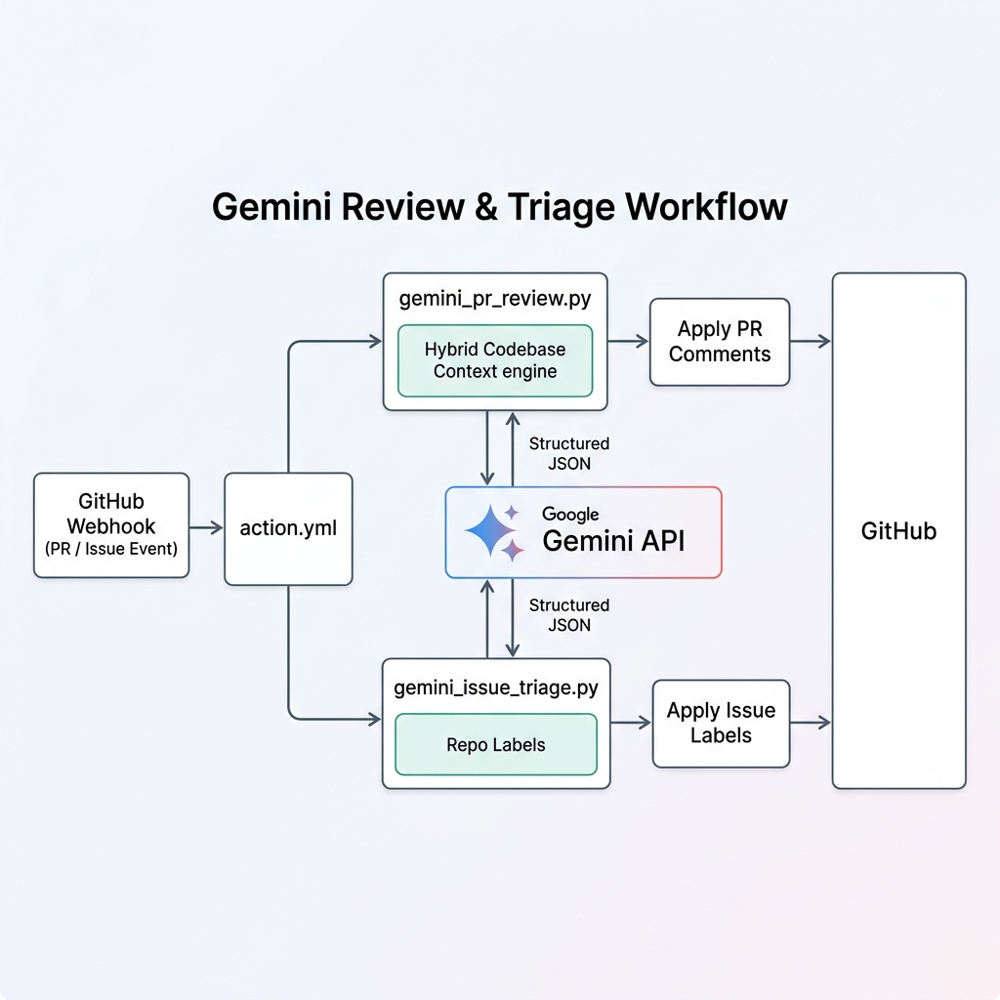

# Architecture & Code Walkthrough

This document provides a technical walkthrough of how the Gemini PR Review & Triage action is implemented, how it handles codebase context, and how the core Python scripts function.

---

## Architecture Overview

The action runs as a native GitHub Composite Action (`action.yml`) that boots a Python environment using `uv` for dependency management.



---

## 🔎 Pull Request Review Script (`gemini_pr_review.py`)

The PR review workflow is designed to retrieve PR details, collect local codebase context, build a structured prompt, and atomically submit line-specific reviews back to GitHub.

### 1. File Discovery & Filtering
* **PR Changes:** The script fetches the list of changed files and their diff patches from the GitHub API using `get_pr_files()`. Locally, it falls back to `git diff main...HEAD`.
* **Binary Exclusion:** Non-text files, binaries, lock files, and encrypted files are filtered out using `is_text_file()`.

### 2. Hybrid Codebase Context Engine
To provide Gemini with project-wide awareness, the script traverses the workspace to find all tracked files via `get_all_repo_files()`. It then sums the file sizes (excluding the changed PR files) to determine the context mode:

* **Full Context Mode (≤ 500 KB):**
  If the rest of the text files in the repository fit within the size limit, the script reads their full contents using `get_file_content()` and appends them to the prompt under the section `=== Repository Context (Full Codebase) ===`.
* **Sparse Context Mode (> 500 KB):**
  If the repository is large, the script generates a visual directory/file tree representation of the codebase using `generate_file_tree()`. It also reads the full contents of only the core documentation or manifest files matching `core_file_patterns` (like `*.md`, `package.json`, `go.mod`, etc.) using `is_core_file()`.

### 3. Structured Output Schemas
Gemini is forced to return structured JSON adhering to the Pydantic schemas:
* `InlineComment`:
  - `path`: File path.
  - `line`: Line number in the RIGHT (modified) side of the diff.
  - `side`: Diff side.
  - `severity`: Severity icon (`🔴`, `🟠`, `🟡`, `🟢`).
  - `comment_text`: Feedback string.
  - `code_suggestion`: Optional drop-in suggestion replacement.
* `ReviewResult`:
  - `summary`: High-level quality assessment.
  - `general_feedback`: List of highlights or observations.
  - `comments`: List of `InlineComment` instances.

### 4. Resilient Review Submissions
Submitting reviews with line-specific comments via GitHub's API can be fragile (e.g. if the model specifies a line index that falls outside the diff range).
* **Atomic Run:** The script first attempts to post the summary and all inline comments in a single transaction via `POST /repos/{owner}/{repo}/pulls/{number}/reviews`.
* **Resilient Fallback:** If the atomic post fails (e.g. returns HTTP 422), the script catches the failure, posts the review summary comment, and attempts to publish individual comments one-by-one. This ensures valid comments are still delivered while preventing a CI checkout block.

---

## 🏷️ Issue Triage Script (`gemini_issue_triage.py`)

The issue triage script automatically categorizes and labels new issues to streamline management.

### 1. Label Triage Retrieval
* The script calls `get_available_labels()` to fetch all labels currently configured on the repository, handling pagination dynamically.

### 2. Prompting & Classification
* The system instruction (loaded from `gemini-triage.toml`) instructs the model to act as a triage assistant.
* The issue's title and body, along with the list of available labels, are passed to Gemini.
* Using structured output, Gemini returns a `TriageResult` containing:
  - `selected_labels`: The subset of repo labels that match the issue.
  - `reasoning`: The explanation for applying those labels.

### 3. API Label Application
* The script calls `apply_labels()` to add the selected labels to the issue on GitHub.

---

## 🛠️ Configuration Options

The action's behavior is configured via `gemini-review.toml`:

```toml
# Default configuration
description = "Reviews a pull request using Google Gemini"
prompt = "..."

# Codebase Context Configuration (Optional)
max_context_bytes = 512000  # Size threshold in bytes to trigger Sparse Mode
core_file_patterns = [
    "*.md",
    "pyproject.toml", "package.json", "go.mod", "Cargo.toml", "pom.xml",
    "build.gradle", "build.gradle.kts", "settings.gradle", "Gemfile",
    "composer.json", "*.csproj", "*.sln", "Dockerfile", "docker-compose.yml",
    "gemini-review.toml", "action.yml"
]
```
