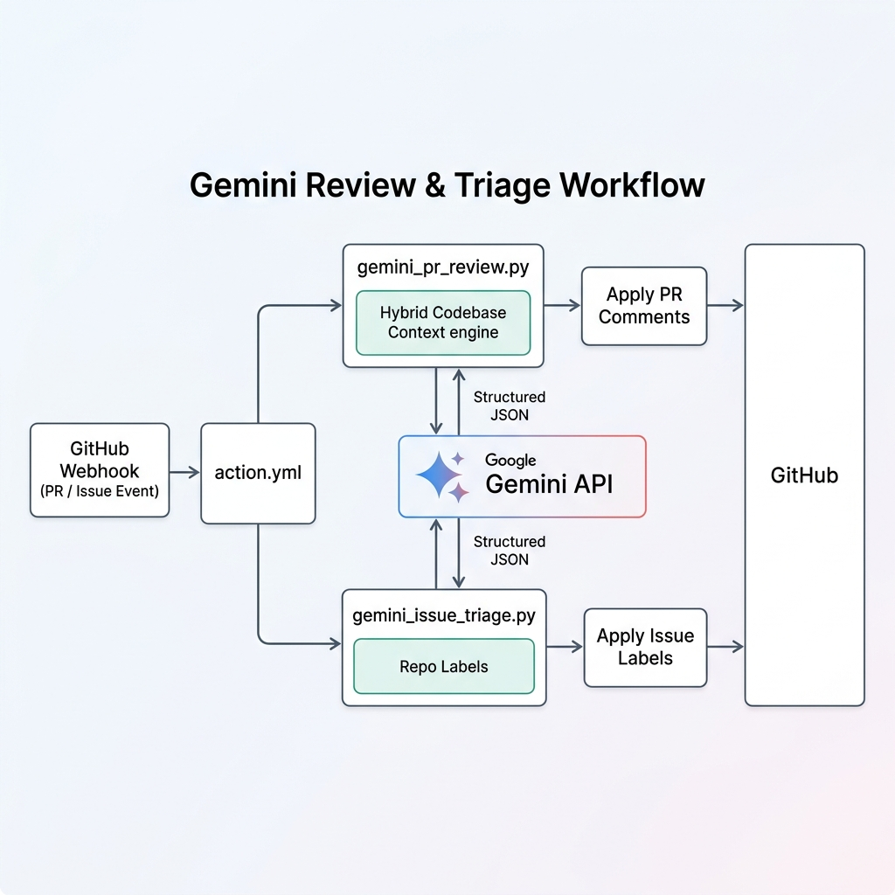

# Architecture & Code Walkthrough

This document provides a technical walkthrough of how the Gemini PR Review & Triage action is implemented, how it handles codebase context, and how the core Python scripts function.

---

## Architecture Overview

The action runs as a native GitHub Composite Action (`action.yml`) that boots a Python environment using `uv` for dependency management.



---

## Code Base Organisation & Package Architecture

The code review action is organized into a modular Python package (`gemini_review/`) separating domain responsibilities, with `gemini_pr_review.py` serving as the top-level execution entrypoint and backward-compatible API facade:

* **`gemini_review/schemas.py`**: Pydantic schemas defining structured outputs (`InlineComment`, `ReviewResult`, `DynamicContextSelection`).
* **`gemini_review/config.py`**: Configuration loader for `gemini-review.toml`, timeout/model defaults, and multimodal budget controls (`max_multimodal_images`, `image_trigger_bytes`, `image_target_bytes`).
* **`gemini_review/multimodal.py`**: Multimodal MIME type detection, image validation, deterministic Pillow downscaling (`optimize_image_bytes`), and document-order Markdown/HTML image reference extraction (`extract_markdown_image_references`).
* **`gemini_review/diff.py`**: Unified diff patch parsing, line numbering annotations (`format_diff_patch_with_line_numbers`), suggestion indentation alignment, line-range auto-correction, and inline comment filtering (`filter_review_comments`).
* **`gemini_review/repo.py`**: File discovery (`get_all_repo_files`), file tree formatting (`generate_file_tree`), core manifest pattern matching (`is_core_file`), import extraction, and candidate pool ranking & bounding (`rank_and_bound_candidates`).
* **`gemini_review/context.py`**: Hybrid codebase context engine (Full vs Sparse mode), core documentation attachment, static extra context overrides, multimodal context binding, and Gemini dynamic context selection (`select_dynamic_context_files`).
* **`gemini_review/prompts.py`**: Custom instruction loaders (`load_custom_instructions`), system prompt builder (`load_system_instruction`), PR diff prompt formatting (`build_pr_diff_prompt`), visual PR diff assembly (`build_visual_diff_parts`), and prompt assembly (`build_prompt`).
* **`gemini_review/utils.py`**: Core primitives (token estimation, response extraction, workspace rules discovery) and facade re-exports for backward compatibility.
* **`gemini_review/github.py`**: GitHub REST API client functions for PR files, comment threads, author filtering, review postings, and raw file blob retrieval (`get_file_blob`).
* **`gemini_review/threads.py`**: Pull request review thread retrieval and automated resolution of addressed threads (`resolve_addressed_threads`).
* **`gemini_review/budget.py`**: Token budget allocation and per-file content truncation (`cap_file_content`) to prevent out-of-budget diffs.
* **`gemini_review/billing_labels.py`**: Google Cloud billing labels parser and sanitisation for GCP cost attribution.
* **`gemini_review/personas.py`**: Reviewer persona registry and prompt generation (`straight`, `dazbo`, `palpatine`, `rick`).
* **`gemini_review/pricing.py`**: Gemini model token pricing and cost estimation engine (including Gemini 3.8 Flash).
* **`gemini_review/skills.py`**: Agent skill metadata parser and instruction loader for workspace and built-in skills.
* **`gemini_review/developer_knowledge.py`**: MCP/RPC integration to search and fetch official Google developer documentation.
* **`gemini_pr_review.py`**: Main CLI entrypoint script that re-exports all `gemini_review` package APIs and runs the primary review loop.

---

## 🔎 Pull Request Review Script (`gemini_pr_review.py`)

The PR review workflow is designed to retrieve PR details, collect local codebase context, build a structured prompt, and atomically submit line-specific reviews back to GitHub.

### 1. File Discovery & Filtering
* **PR Changes:** The script fetches the list of changed files and their diff patches from the GitHub API using `get_pr_files()`. Locally, it falls back to `git diff main...HEAD`.
* **Binary Exclusion:** Non-text files, binaries, lock files, and encrypted files are filtered out using `is_text_file()`.

### 2. Hybrid Codebase Context Engine
To provide Gemini with project-wide awareness, the script traverses the workspace to find all tracked files via `get_all_repo_files()`. It then sums the file sizes (excluding the changed PR files) to determine the context mode:

* **Per-File Content Truncation (`cap_file_content`):** To prevent a single abnormally large file (e.g. bundled assets, minified scripts, or large test fixtures) from monopolising the context budget, individual text files attached to the prompt are capped at 128 KB with a truncation notice.
* **Full Context Mode (≤ 1.5 MB):**
  If the rest of the text files in the repository fit within the size limit, the script reads their full contents using `get_file_content()` and appends them to the prompt under the section `=== Repository Context (Full Codebase) ===`.
* **Sparse Context Mode (> 1.5 MB):**
  If the repository exceeds the threshold, the action activates Sparse Context Mode:
  1. **Visual Directory File Tree:** Generates a structured representation of the codebase using `generate_file_tree()`.
  2. **Core Manifests & Documentation:** Reads full contents of key configuration and root documentation files matching `core_file_patterns` (e.g. `README*`, `CONTRIBUTING*`, `ARCHITECTURE*`, `GEMINI.md`, `package.json`, `go.mod`, `pyproject.toml`) via `is_core_file()`, up to a configurable `max_core_context_bytes` budget (default 500 KB).
  3. **Candidate Bounding & Heuristics:** In large repositories or monorepos, candidate non-core files are filtered against expanded built-in exclusions (lockfiles, minified bundles, source maps, test snapshots, data/model binaries) and optional user-defined `context_exclude_patterns`. Candidates are ranked and bounded via `rank_and_bound_candidates()` using directory proximity, regex import references, and sister test/source naming, capping the candidate pool at `max_candidate_files` (default: 500) or strictly scoping to modified directories via `context_diff_directories_only`.
  4. **Dynamic Context Selection:** Invokes a structured Gemini model call via `select_dynamic_context_files()` to analyse the PR diff and evaluate the bounded candidate files against a 4-tier architectural prioritisation framework. It dynamically selects up to 8 of the most relevant sister modules, utilities, domain/algorithmic precedents, or unit test files to attach directly into the review prompt. Alternatively, specifying `extra_context_files` attaches specified files directly, bypassing the dynamic selector API call.
  5. **Telemetry & Thinking Support:** Thinking levels or token budgets configured via `thinking_level` are applied via `ThinkingConfig` with automatic resilient fallback if unsupported by the target model. Thinking tokens (`thoughts_token_count`) and dynamic context selection API usage are tracked, billed at output rates, and reported in the review comment telemetry table.


### 3. Gemini Context Caching Engine
To drastically reduce API costs and latency for large codebase contexts, `gemini_pr_review.py` incorporates native **Gemini Context Caching**:

* **Threshold Verification**: If the codebase context exceeds 100,000 characters (~32,768 tokens, Gemini's minimum caching requirement), context caching is automatically activated.
* **Deterministic Active Cache Lookup (`client.caches.list()`)**: Before creating a new cache, the script queries active server-side caches matching the model and persona-scoped repository display name (`repo-cache-{repo}-{model}-{persona}`). It validates that the cache's model matches the requested model, skipping any caches created under a different model version to avoid `INVALID_ARGUMENT` errors.
* **Stateless Zero-Infrastructure Persistence**: No local state, runner disk storage, or database is required between workflow runs. Active context caches are queried dynamically on Gemini's API servers using the deterministic display name key.
* **Tenant Isolation & Security**: Context caches are hosted on Google's infrastructure and strictly isolated to your API key / GCP project namespace. No third-party or unauthorized API key can access or view cached context.
* **Cache Provisioning (`client.caches.create()`)**: If no matching active cache handle for the current model is found, the script provisions a new `CachedContent` resource containing the codebase context, `system_instruction`, and pre-parsed `tools`.
* **Cost & Multi-Turn Optimisation**: Input tokens billed against the cached handle receive a **90% discount**. Furthermore, multi-turn tool interactions (such as Google Developer Knowledge MCP searches or skill lookups) reference the cached handle without re-billing the codebase context on subsequent turns.
* **Resilient Fallback**: If cache creation, lookup, or generation with cached content fails for any reason, the script seamlessly falls back to direct context generation without interrupting the CI review pipeline.

### 4. PR Comment & Discussion Thread History Engine
When enabled via `include_comment_history: 'true'` (default), `gemini_pr_review.py` fetches complete historical discussion context from the GitHub API:
* **Inline & Conversation Retrieval (`get_pr_comments()`)**: Fetches inline review comments (`pulls/{pr_number}/comments`) and general PR issue comments (`issues/{pr_number}/comments`) using `while True` pagination loops (`per_page=100`) to guarantee all historical comments are captured.
* **Comment Author Filtering (`exclude_comment_authors`)**: Selectively filters out automated comments from secondary bots (such as `claude[bot]`) before prompt generation using `filter_comment_authors()`, preventing competing review conclusions from skewing the evaluation.
* **Thread Structuring (`format_pr_comment_history()`)**: Groups comments into root comments and nested developer replies per file and line number, presenting clear conversational timelines to Gemini.
* **Resolution Decision Matrix**: Instructs Gemini not to repeat suggestions that have been addressed in code, deferred, or explicitly justified by developers, while ensuring unresolved items without explanation or un-applied agreed fixes are re-flagged.
* **Automated Thread Resolution (`resolve_addressed_threads`)**: When enabled via action inputs, the action resolves GitHub review conversation threads using `fetch_review_threads()` and `resolve_addressed_threads()` for issues Gemini explicitly reports in `ReviewResult.resolved_items`, unblocking GitHub's *Require conversation resolution before merging* branch rule.

### 5. Multimodal Context & Visual PR Diffing Engine
`gemini_pr_review.py` and `gemini_review/prompts.py` seamlessly integrate multimodal content (images and PDF documentation) into the Gemini evaluation workflow:

* **Markdown Image Reference Extraction (`extract_markdown_image_references`)**:
  Whenever markdown documentation is included in the review prompt (core project documentation, diff additions, extra context files, or dynamically selected files), regex parsers extract local image paths referenced via standard Markdown (``) or HTML (``). Paths are resolved relative to the markdown file, validated against path traversal via `os.path.commonpath`, and attached as multimodal parts (`types.Part.from_bytes`).
* **Visual PR Diffing (`build_visual_diff_parts`)**:
  When a PR adds, removes, or modifies visual assets (`.png`, `.jpg`, `.jpeg`, `.webp`, `.gif`, `.svg`):
  - For modified images, both the baseline version (`base_sha`) and the updated version (`head_sha`) are retrieved via `get_file_blob()` (GitHub API) or `get_git_blob()` (local Git).
  - The assets are assembled into labelled before-and-after visual diff parts, enabling Gemini to review UI changes, layout consistency, and potential visual regressions.
  - Added and removed image assets are similarly captured with descriptive labels.
* **Deterministic Pillow Downscaling (`optimize_image_bytes`)**:
  To prevent large raster graphics from inflating context token usage or request latency, raster images exceeding `image_trigger_bytes` (default: 600 KB / 614,400 bytes) are resized using high-quality Lanczos resampling and re-compressed towards `image_target_bytes` (default: 300 KB / 307,200 bytes). SVGs and PDFs pass through uncompressed to preserve vector fidelity and document layout.
* **Safety Ceilings & Token Heuristics**:
  A configurable cap (`max_multimodal_images`, default: 20) bounds total multimodal attachments across context and visual diffs. The token estimation engine (`count_text_tokens`) incorporates a 258 tokens/part heuristic fallback for multimodal parts when offline or mocking API responses.

### 6. Structured Output Schemas
Gemini is forced to return structured JSON adhering to the Pydantic schemas:
* `InlineComment`:
  - `path`: File path.
  - `line`: Line number in the RIGHT (modified) side of the diff.
  - `side`: Diff side.
  - `severity`: Severity icon (`🔴`, `🟠`, `🟡`, `🟢`).
  - `comment_text`: Feedback string.
  - `code_suggestion`: Optional drop-in suggestion replacement.
* `ReviewResult`:
  - `summary`: High-level quality assessment.
  - `resolved_items`: List of previously raised review comments/threads resolved in the current PR iteration.
  - `general_feedback`: List of highlights or observations.
  - `comments`: List of `InlineComment` instances.

### 7. Resilient Review Submissions
Submitting reviews with line-specific comments via GitHub's API can be fragile (e.g. if the model specifies a line index that falls outside the diff range).
* **Atomic Run:** The script first attempts to post the summary, resolved items list (`### ✅ Resolved Items from Prior Reviews`), and all inline comments in a single transaction via `POST /repos/{owner}/{repo}/pulls/{number}/reviews`.
* **Resilient Fallback:** If the atomic post fails (e.g. returns HTTP 422), the script catches the failure, posts the review summary comment, and attempts to publish individual comments one-by-one. This ensures valid comments are still delivered while preventing a CI checkout block.

### 8. Review Prompt Customisation: Extending vs Replacing

The review prompt assembly in `gemini_review/prompts.py` provides two distinct customisation tiers:

* **Extending Instructions & Guardrails (`custom_instructions` / `load_custom_instructions`)**:
  Enables teams to layer on repository-specific guardrails, architectural standards, or forbidden libraries without discarding the built-in 5-axis quality evaluations or persona overlays. It resolves convention-based markdown files (`.github/review-instruction-additions.md` with fallback to `review-instruction-additions.md` at root), or inline text supplied via the `custom_instructions` action input in workflow YAML, seamlessly appending them under `## Additional Review Instructions & Guardrails:`.
* **Replacing Instructions Entirely (`gemini-review.toml`)**:
  When a repository needs to author a bespoke system prompt from scratch, placing `.github/commands/gemini-review.toml` in the repository completely replaces the base prompt template.

---

## 🏷️ Issue Triage Script (`gemini_issue_triage.py`)

The issue triage script automatically categorises and labels new issues to streamline management.

### 1. Label Triage Retrieval
* The script calls `get_available_labels()` to fetch all labels currently configured on the repository, handling pagination dynamically.

### 2. Prompting & Classification
* The system instruction (loaded from `gemini-triage.toml`) instructs the model to act as a triage assistant.
* The issue's title and body, along with the list of available labels, are passed to Gemini.
* Using structured output, Gemini returns a `TriageResult` containing:
  - `selected_labels`: The subset of repo labels that match the issue.
  - `reasoning`: The explanation for applying those labels.

### 3. API Label Application
* The script calls `apply_labels()` to add the selected labels to the issue on GitHub.

---

## 🛠️ Configuration Architecture

The action maintains a strict separation of concerns between operational parameters and prompt templates:

* **Operational Action Inputs (`action.yml` / Workflow YAML)**: All operational configuration parameters (such as `gemini_model`, `custom_instructions`, `exclude_comment_authors`, `resolve_addressed_threads`, `skip_inline_suggestions`, `include_comment_history`, `language`, `persona`, and `timeout`) are configured via action inputs in your workflow `.yml` file and mapped to environment variables (`GEMINI_*`).
* **Prompt Overrides (`gemini-review.toml`)**: `gemini-review.toml` is strictly reserved for custom system prompt overrides and codebase context tuning thresholds:

```toml
# Default configuration
description = "Reviews a pull request using Google Gemini"
prompt = "..."

# Codebase Context Configuration (Optional)
max_context_bytes = 1500000  # Size threshold in bytes to trigger Sparse Mode (default: 1.5 MB)
max_core_context_bytes = 500000  # Max bytes for static core docs/manifests in Sparse Mode (default: 500 KB)
core_file_patterns = [
    "*.md",
    "pyproject.toml", "package.json", "go.mod", "Cargo.toml", "pom.xml",
    "build.gradle", "build.gradle.kts", "settings.gradle", "Gemfile",
    "composer.json", "*.csproj", "*.sln", "Dockerfile", "docker-compose.yml",
    "gemini-review.toml", "action.yml"
]
```

---

## 🏛️ Architectural Decision: Direct Gemini API vs. Managed Agents (Interactions API)

### Context & Evaluation

Google provides **Google Managed Agents** (such as the **Antigravity Agent**) via the stateful **Interactions API** (`interactions.create`). Managed agents execute inside a Google-hosted, OS-isolated Linux sandbox VM equipped with native tool harnesses (file mounting, shell execution, web search) and multi-turn state persistence.

During the architectural design of this action, I evaluated using Managed Agents (`interactions.create`) versus the direct Gemini Model API (`client.models.generate_content`) paired with native Gemini Context Caching (`client.caches`).

### Architectural Comparison

| Dimension | Direct Gemini API + Context Caching (Selected) | Managed Agents / Interactions API |
| :--- | :--- | :--- |
| **API Primitives** | `client.models.generate_content` + `client.caches` | `client.interactions.create` + `agent_config` |
| **Execution Environment** | Client-side Python runner on GitHub Runner | Google-hosted cloud Linux sandbox VM |
| **Codebase Context Strategy** | Native Gemini Context Caching (`CachedContent`) | Repo mounted in VM sandbox via environment sources |
| **Input Token Pricing** | **90% discount** on cached tokens (>100k chars) | Standard token pricing per interaction turn |
| **Startup Overhead & Latency** | Near-zero (direct token generation) | VM sandbox boot & cold-start latency per job |
| **State Management** | Stateless single-turn pass per PR commit | Persistent multi-turn sessions (`previous_interaction_id`) |
| **API Maturity** | GA (General Availability) | Public Preview |

### Decision Rationale

I selected the **Direct Gemini API + Context Caching** model based on the following technical trade-offs:

1. **Latency & CI Execution Speed**:
   Code review in a CI pipeline requires rapid execution feedback. Managed Agent sandboxes incur non-negligible cold-start boot latency when provisioning remote containers for each workflow trigger. Direct API generation starts producing feedback immediately.

2. **Context Caching Cost Optimisation (90% Input Token Savings)**:
   For repositories with large codebase contexts (>100,000 characters), my context caching engine creates a server-side `CachedContent` handle that persists across workflow runs. Subsequent PR review runs referencing the cache receive a **90% discount** on cached input tokens. Managed agent environments load context into a remote VM container filesystem, which does not benefit from native `CachedContent` input token discounts.

3. **Appropriate Complexity for CI Workflows**:
   A Pull Request review is inherently a single-turn structured evaluation per git commit. The heavyweight architecture of a persistent Linux VM sandbox container (with mounted tool shims and session state tracking) introduces unnecessary complexity compared to a focused Python execution loop running on the native GitHub Action runner.

4. **Security & Credential Scope**:
   Passing repository access tokens into remote cloud VM sandboxes (even with egress proxy header transforms) broadens the credential trust boundary. Running the review logic locally on the ephemeral GitHub runner ensures standard GitHub Actions secret isolation.

5. **API Stability**:
   Direct API generation and Context Caching primitives are generally available (GA) with guaranteed SLAs, avoiding reliance on Public Preview APIs for production CI pipelines.

### References
* [Google Managed Agents Overview](https://ai.google.dev/gemini-api/docs/agents)
* [Antigravity Agent Documentation](https://ai.google.dev/gemini-api/docs/antigravity-agent)
* [Agent Environment Overview](https://ai.google.dev/gemini-api/docs/agent-environment)

